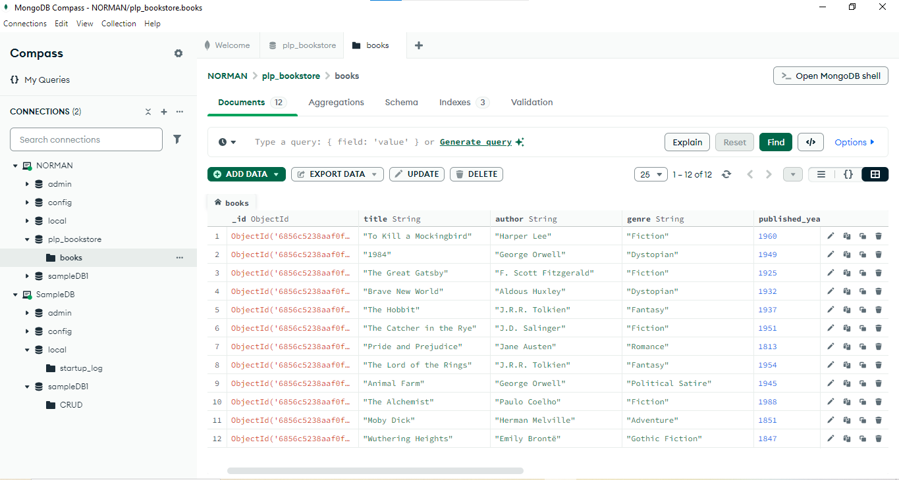

## 🖼️ Screenshot: MongoDB Compass

View of the `books` collection after insertion:



# 📚 MongoDB Fundamentals Assignment – Week 1

This project includes scripts to insert sample book data into a MongoDB collection and run various types of queries (basic, advanced, aggregation, indexing) using Node.js.

---

## 📁 Folder Contents

| File             | Purpose                                         |
|------------------|-------------------------------------------------|
| `insert_books.js`| Inserts 12 sample books into the database       |
| `queries.js`     | Runs various MongoDB queries using Node.js      |
| `package.json`   | Automatically generated by `npm install`        |

---

## 🧰 Prerequisites

- Node.js installed: [https://nodejs.org/](https://nodejs.org/)
- MongoDB Atlas account or local MongoDB server
- MongoDB Compass (optional for GUI)
- Internet connection if using MongoDB Atlas

---

## 🔧 Setup Instructions

### 1. Clone or download the project

Open a terminal and navigate to the folder:

```bash
cd "path-to-folder"
```

### 2. Install dependencies

Install the required MongoDB Node.js driver:

```bash
npm install mongodb
```

This creates a `node_modules/` folder and `package-lock.json`.

---

## 🚀 Running the Scripts

### ✅ Insert sample data

This script will insert 12 predefined books into your MongoDB database.

```bash
node insert_books.js
```

### ✅ Run queries (basic, advanced, aggregation, indexing)

```bash
node queries.js
```

The output will display in your terminal. Make sure your database contains books from the `insert_books.js` script first.

---

## 🧠 Notes

- Make sure to **update your MongoDB connection URI** in both scripts:
  ```js
  const uri = "mongodb+srv://<username>:<password>@cluster0.mongodb.net/?retryWrites=true&w=majority";
  ```

- If you're using **local MongoDB**, use:
  ```js
  const uri = "mongodb://localhost:27017";
  ```

- Database name used: `library`  
- Collection name used: `books`

---

## 📷 Optional: View Data in Compass

1. Open MongoDB Compass  
2. Paste your connection string  
3. Navigate to `library > books`  
4. Browse documents visually

---

## ✅ Tasks Covered

- ✔️ Insert documents
- ✔️ Basic queries
- ✔️ Advanced queries (filter, sort, pagination)
- ✔️ Aggregation pipeline
- ✔️ Index creation & performance checking
